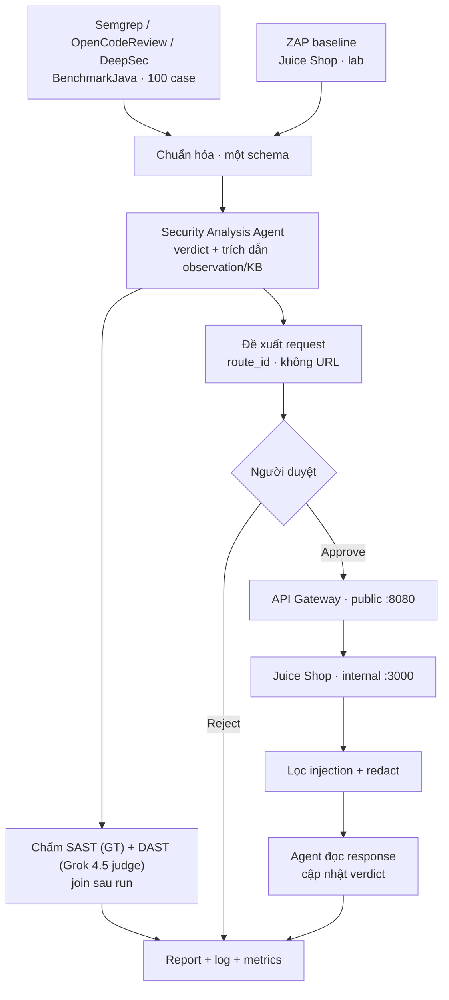

# Project Sentinel

Scanner báo hàng trăm cảnh báo. Phần lớn không phải lỗ hổng. Sentinel là lớp
phân tích nằm giữa scanner và con người: đọc evidence, ra **một verdict có
trích dẫn**, và khi thiếu bằng chứng thì **đề xuất một request** để kiểm tra
thật - người duyệt, request chỉ đi qua API Gateway.

Hai nguồn, một agent, một hợp đồng JSON:

| | SAST | DAST |
| :--- | :--- | :--- |
| Mục tiêu | 100 case đầu [OWASP BenchmarkJava](https://github.com/OWASP-Benchmark/BenchmarkJava) | [OWASP Juice Shop](https://owasp.org/www-project-juice-shop/) trong lab |
| Công cụ | Semgrep, OpenCodeReview, DeepSec/Pi | ZAP baseline (passive) |
| Ground truth | Có - đo TP/FP/FN/TN | Không corpus; P/R = LLM-as-judge (Grok 4.5) |
| Probe HTTP | Không (chỉ đọc source, không deploy) | Có - qua API Gateway |

WebGoat không nằm trong dataset đang hoạt động.

**Live demo (đọc artifact đã commit, không cần API key, không gửi probe):**
[https://sentinel-ui.up.railway.app/](https://sentinel-ui.up.railway.app/)

## Luồng



Python group, retrieve KB, gọi model, validate và ghi file. LLM chỉ điền field
trong schema. Identifier, CWE, location do Python gắn - model không được bịa.
Bước 5-8 (duyệt → gateway → lọc → cập nhật) **chỉ chạy trên DAST**.

Verdict: `confirmed_vulnerable` | `likely_vulnerable` | `likely_false_positive` |
`not_vulnerable` | `insufficient_evidence` (abstain, đếm cột riêng). Rationale
bắt buộc trích dẫn `observation_id` và document KB. Evidence Guard là Python,
không hỏi lại model.

## Số liệu hiện tại

Từ artifact đã commit. Không số nào nhập tay.

| Hạng mục | Kết quả | Nguồn |
| :--- | ---: | :--- |
| BenchmarkJava cases | 100 | corpus pin |
| SAST observations | 372 | [baseline.json](artifacts/week-3/baseline.json) |
| SAST groups | 99 | cùng file (1 case không có observation) |
| DAST | 9 loại alert / 18 URL / 33 observation / 18 group | [dast/manifest.json](artifacts/week-6/dast/manifest.json) |
| Knowledge documents | 38 | [security-topics.jsonl](datasets/knowledge/security-topics.jsonl) |
| Eval set (team-authored) | 10 case | [datasets/evaluation/](datasets/evaluation/) |
| Automated tests | 140 | `pytest -q` |

SAST, 25 nhóm, model `gpt-5.6-luna`, payload có source + KB v2
([verdict-metrics-sast-v4.json](artifacts/week-3/evaluation/verdict-metrics-sast-v4.json)):

| TP | FP | FN | TN | Precision | Recall | F1 |
| ---: | ---: | ---: | ---: | ---: | ---: | ---: |
| 21 | 3 | **0** | 1 | 0.875 | **1.0** | 0.933 |

Cùng 25 nhóm, trước khi có source trong payload: TN = 0, precision 0.833. FN = 0
giữ nguyên: không lỗ hổng thật nào bị bỏ qua.

DAST, một lần `flow.py` thật 173 giây
([metrics](artifacts/week-6/metrics/20260822T093819Z-flow.json)):

| Đề xuất | Duyệt / Từ chối | Gửi | Verdict đổi | `rejected_but_sent` |
| ---: | ---: | ---: | ---: | ---: |
| 10 request / 16 finding | 8 / 2 | 8 | 6 | **0** |

Sau probe: 5 `confirmed_vulnerable`, 3 `likely_vulnerable`, 5 `not_vulnerable`,
1 `likely_false_positive`, 4 abstain. Verdict cũ nằm trong
`verification.verdict_before` - không bị xoá.

## Chạy nhanh

```bash
git submodule update --init --recursive
python -m pip install -r requirements.txt && python -m pip install -e .
python -m sentinel_benchmark.indexer
python -m pytest -q
```

Xem dashboard local (cổng **8090**, tránh trùng gateway 8080):

```bash
PYTHONPATH=src uvicorn app.web.main:app --port 8090
```

Lab DAST + cả chuỗi (Docker). Chỉ gateway publish `localhost:8080`; Juice Shop
lắng nghe `:3000` trong mạng compose, không map ra host:

```bash
cp .env.example .env          # OPENCODE_API_KEY; gateway key do stack.sh sinh
bash scripts/stack.sh up
bash scripts/stack.sh scan    # ZAP -> artifacts/week-6/dast/
python scripts/flow.py --provider nine_router
# normalize -> analyse -> propose -> y/n -> gateway -> filter -> verify
bash scripts/stack.sh down
```

Từng mắt: [docs/handover/demo-guide.md](docs/handover/demo-guide.md).
Kịch bản nói 10-15 phút: [docs/handover/demo-script.md](docs/handover/demo-script.md).

Public UI (`SENTINEL_UI_READONLY=1`) chỉ đọc artifact. Gửi probe thật chỉ khi
stack local đang lên và duyệt trên CLI (`flow.py` / `probe.py run`).

## Tiến độ

| Tuần | Sản phẩm |
| :--- | :--- |
| 1 | Scanner output, predictions, Semgrep SARIF trên 100 case |
| 2 | Observation schema, SQLite FTS5, KB |
| 3 | Security Analysis Agent, Evidence Guard, JSONL |
| 4 | API Gateway (repo riêng, submodule): allowlist |
| 5 | Redaction, prompt-injection filter, approval gate |
| 6 | Juice Shop + ZAP, request tool qua gateway, verdict + probe cập nhật report, scoring + eval set, Compose, dashboard |

Báo cáo: [`reports/`](reports/). Artifact: [`artifacts/`](artifacts/).
Bàn giao: [docs/handover/README.md](docs/handover/README.md).

## Tài liệu

- [Kiến trúc](docs/handover/architecture.md) · [Cài đặt](docs/handover/install.md) · [Product brief](docs/handover/product-brief.md)
- [Verdict và cách đo](docs/methodology/verdict-and-scoring.md)
- [DAST trên Juice Shop](docs/methodology/dast-juice-shop.md)
- [Request tool](docs/methodology/request-tool.md)
- [System Prompt](docs/prompts/week6-security-analysis-agent.md)
- [Deployment](docs/deployment.md)

## An toàn

BenchmarkJava và Juice Shop cố ý chứa lỗ hổng. Không deploy chúng ra Internet.
Trong Compose cả hai nằm trên mạng `internal: true` và không publish port - chỉ
gateway mở `8080`. ZAP chỉ quét passive. Dashboard công khai chỉ hiện findings,
metrics và report đã redact.
