# Project Sentinel

Project Sentinel biến kết quả từ nhiều công cụ quét bảo mật thành một luồng phân tích mà người review có thể theo dõi từ đầu đến cuối. Thay vì đọc hàng trăm cảnh báo rời rạc, người dùng có thể chọn một nhóm lỗ hổng, xem bằng chứng từ từng scanner, đọc phần giải thích của Agent và tải báo cáo JSONL để review tiếp.

Phạm vi hiện tại là 100 test case đầu tiên của [OWASP BenchmarkJava](https://github.com/OWASP-Benchmark/BenchmarkJava). Đây là bộ mã cố ý chứa cả trường hợp có và không có lỗ hổng, phù hợp để kiểm tra scanner và cách Agent xử lý evidence. WebGoat không nằm trong dataset đang hoạt động.

[Mở Streamlit UI](https://sentinel-benchmarkjava.streamlit.app/) · [Đọc báo cáo Week 3](reports/week-3/2026-08-07_NguyenNhuYenPhuong_Week3.md) · [Xem System Prompt](docs/prompts/week3-security-analysis-agent.md)

Nếu Streamlit yêu cầu đăng nhập, deployment chưa được bật public; có thể chạy bản local bằng các lệnh ở cuối README.

## Có thể xem gì trên demo?

Một lượt demo ngắn thường đi theo năm bước:

1. **Overview** cho biết phạm vi dữ liệu, số cảnh báo của từng scanner và kết quả chạy Agent.
2. **Findings Explorer** giữ cả cảnh báo gốc, canonical groups của Week 2 và analysis groups của Week 3 để có thể truy ngược nguồn.
3. **Agent Analysis** đặt scanner evidence, tài liệu KB và báo cáo cạnh nhau. Có thể chọn một CWE cụ thể, chẳng hạn `CWE-327 — Broken or Risky Cryptographic Algorithm`, rồi hỏi Sentinel cách giải thích, xác minh hoặc khắc phục.
4. **Reports** hiển thị báo cáo đã tạo, model sử dụng, confidence, nguồn tham chiếu và nút tải JSONL.
5. **Evaluation** tách riêng chất lượng scanner, tính toàn vẹn của grouping, kết quả Agent và các failure case.

Public UI chỉ đọc artifact đã tạo sẵn nên không cần API key và không tự gọi model. Khi chạy local, người dùng có thể bật 9Router để hỏi đáp hoặc tạo report mới sau một bước xác nhận rõ ràng.

## Agent làm việc như thế nào?

```mermaid
flowchart LR
    A[OpenCodeReview<br/>DeepSec/Pi<br/>Semgrep] --> B[372 scanner<br/>observations]
    B --> C[Normalize và<br/>group alerts]
    C --> D[Retrieve từ<br/>12 KB documents]
    D --> E[System Prompt<br/>+ evidence + schema]
    E --> F[9Router LLM<br/>phân tích lỗ hổng]
    F --> G[Pydantic +<br/>Evidence Guard]
    G --> H[JSONL reports<br/>review và export]

    classDef source fill:#E0F2FE,stroke:#0284C7,color:#0C4A6E;
    classDef process fill:#CCFBF1,stroke:#0F766E,color:#134E4A;
    classDef agent fill:#EDE9FE,stroke:#7C3AED,color:#4C1D95;
    classDef check fill:#FEF3C7,stroke:#D97706,color:#78350F;
    classDef result fill:#DCFCE7,stroke:#16A34A,color:#14532D;
    class A,B source;
    class C,D,E process;
    class F agent;
    class G check;
    class H result;
```



Python đảm nhiệm các phần cần kết quả xác định: đọc artifact, chuẩn hóa, grouping, tìm kiếm KB, gọi provider, validate và ghi file. LLM chỉ tạo phần phân tích gồm severity, explanation, verification steps, remediation, limitations và confidence.

Analysis group của Week 3 được tạo theo Benchmark test và expected CWE. Cách này giúp hợp nhất cảnh báo mà các scanner mô tả khác nhau, nhưng được ghi rõ là `benchmark_assisted`; nó chưa phải phương pháp grouping dành cho repository không có metadata chuẩn.

## Kết quả đã kiểm chứng

| Hạng mục | Kết quả hiện tại |
| :--- | ---: |
| BenchmarkJava test cases | 100 |
| Scanner observations | 372 |
| Week 2 canonical groups | 371 |
| Week 3 analysis groups | 99 |
| Knowledge documents | 12 |
| FakeProvider full run | 99/99 |
| 9Router real smoke run | 5/5 |
| Schema, Guard và evidence preservation | 100% |
| Automated tests | 18 passed |

Ba scanner đóng góp 131 observations từ Alibaba OpenCodeReview, 152 từ Vercel DeepSec/Pi và 89 từ Semgrep `p/security-audit`. Các số liệu grouping được sinh trong [baseline.json](artifacts/week-3/baseline.json); kết quả Agent nằm trong [agent-metrics.json](artifacts/week-3/evaluation/agent-metrics.json).

FakeProvider không dùng dữ liệu mẫu viết tay. Nó đọc đúng 372 observations và KB thật, sau đó đi qua cùng schema, runner, Evidence Guard và artifact writer như 9Router. Mục đích của full run 99/99 là kiểm tra pipeline ổn định mà không phụ thuộc mạng hoặc quota. Real run 5/5 dùng 9Router để xác nhận luồng LLM có thể xử lý dữ liệu thật; đây là smoke test, không được trình bày như kết quả đánh giá toàn bộ 99 groups.

## Vì sao báo cáo có thể kiểm tra lại?

- Mỗi report giữ observation IDs, scanner, vị trí, KB document IDs, prompt hash, provider, model và run ID.
- Test ID, CWE, location và tool do Python gắn từ dữ liệu gốc; model không được phép sinh lại các trường này.
- Ground truth và nhãn TP/TN/FP/FN chỉ xuất hiện ở bước Evaluation, không được gửi vào prompt.
- Evidence Guard từ chối JSON sai schema, field ngoài contract và citation không tồn tại.
- Mỗi run có manifest, summary, error records và SHA-256 checksums. UI báo lỗi nếu artifact không còn khớp checksum.
- Một group lỗi không làm dừng cả batch; lỗi được lưu riêng để review.

System Prompt và output contract được lưu tại [docs/prompts/week3-security-analysis-agent.md](docs/prompts/week3-security-analysis-agent.md). Agent không tự gọi tool một cách tự trị; Python điều phối grouping, keyword retrieval, provider và Guard theo flow cố định ở trên.

## Tiến độ từ Week 1 đến Week 3

| Tuần | Câu hỏi cần giải quyết | Sản phẩm chính |
| :--- | :--- | :--- |
| Week 1 | Các scanner tìm thấy gì trên cùng 100 test case? | Raw outputs, normalized predictions, scanner metrics và Semgrep SARIF |
| Week 2 | Làm sao đưa kết quả khác schema vào cùng một nơi để tìm kiếm? | Common observation schema, SQLite FTS5 index và knowledge base 12 tài liệu |
| Week 3 | Làm sao biến scanner evidence thành báo cáo dễ hiểu mà không bịa nguồn? | Security Analysis Agent, Evidence Guard, grounded chat, JSONL reports và evaluation |

Báo cáo theo tuần nằm trong [`reports/`](reports/). Artifact máy sinh được giữ riêng trong [`artifacts/`](artifacts/) để mọi con số trong báo cáo đều có thể truy ngược.

## Chạy trên máy local

Yêu cầu Python 3.11 trở lên và [uv](https://docs.astral.sh/uv/):

```powershell
git submodule update --init --recursive
uv sync
uv run python -m sentinel_benchmark.indexer
uv run pytest -q
uv run streamlit run app/streamlit_app.py
```

Không cần cấu hình model nếu chỉ muốn xem final artifacts. Để chạy 9Router, sao chép `.env.example` thành `.env`, điền endpoint/model/key local và đặt:

```dotenv
SENTINEL_UI_READONLY=0
```

Các lệnh tái lập Week 3:

```powershell
uv run python scripts/analyze.py baseline
uv run python scripts/analyze.py run --provider fake --limit 99 --tag ci-full
uv run python scripts/analyze.py preflight --provider nine_router
uv run python scripts/analyze.py run --provider nine_router --limit 5 --tag real-smoke
uv run python scripts/analyze.py evaluate --fake-tag ci-full --real-tag real-smoke
```

## Tài liệu liên quan

- [Thiết kế Security Analysis Workspace](docs/security-analysis-workspace.md)
- [Phương pháp chọn 100 BenchmarkJava cases](docs/methodology/benchmark-sampling.md)
- [Cấu trúc repository](docs/repository-layout.md)
- [Hướng dẫn deployment](docs/deployment.md)
- [Week 3 report](reports/week-3/2026-08-07_NguyenNhuYenPhuong_Week3.md)

## Lưu ý an toàn

BenchmarkJava chứa mã dễ bị khai thác theo thiết kế. Repository chỉ dùng source này làm corpus đánh giá; không deploy ứng dụng BenchmarkJava ra Internet. Streamlit app chỉ hiển thị findings, metrics và report artifacts, không chạy web application có lỗ hổng.
