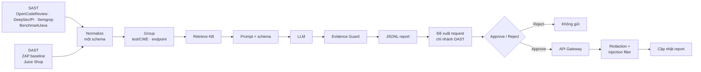

# Project Sentinel

Security Analysis Agent đọc kết quả scanner từ **hai nguồn** rồi kết luận finding nào là lỗ hổng thật:

- **SAST** trên 100 test case đầu của [OWASP BenchmarkJava](https://github.com/OWASP-Benchmark/BenchmarkJava) — có ground truth nên đây là nơi đo độ chính xác. Chỉ đọc source, không deploy.
- **DAST** trên [OWASP Juice Shop](https://owasp.org/www-project-juice-shop/) chạy trong lab, quét bằng ZAP baseline (passive) — không có ground truth nhưng có endpoint sống, nên đây là nguồn duy nhất đề xuất được request kiểm tra.

Cả hai đi qua cùng một bộ chuẩn hoá, cùng một agent, cùng một output contract. WebGoat không nằm trong dataset đang hoạt động.

[](https://sentinel-benchmarkjava.streamlit.app/)

Public UI đọc artifact đã commit. Không cần API key và không gọi API Gateway live.

## Review Week 5

Mentor mở [reports/week-5/README.md](reports/week-5/README.md) và đi đúng thứ tự: báo cáo → **Kiểm chứng an toàn** (Từ chối, rồi Duyệt và gửi) → `guardrails/`, test và `artifacts/week-5/`.

## Demo

Sidebar chia ba nhóm:

1. **PHÂN TÍCH** — Tổng quan, luồng hệ thống, lỗ hổng & bằng chứng, knowledge base, report của Agent. Mở thử `CWE-89` hoặc `CWE-327`.
2. **KIỂM CHỨNG** — **Kiểm chứng an toàn**: đề xuất request → **Từ chối** / **Duyệt và gửi** → phản hồi đã redact; prompt injection thì flag + quarantine.
3. **KẾT QUẢ** — số liệu vận hành, JSONL, kiểm định. Ma trận TP/TN/FP/FN trên UI đang lấy smoke/fake run Week 3, chưa phải evaluation set 5–10 case.

**Bắt đầu bản trình diễn** trên sidebar dẫn lần lượt. Public mode không gọi OpenCode.

## Pipeline



Python đọc artifact, group, retrieve KB, gọi provider, validate và ghi file. LLM chỉ điền field trong schema. `observation_id`, CWE, location và tool do Python gắn từ dữ liệu gốc — model không được sinh lại.

Week 4 để lại API Gateway (service ngoài repo): mọi probe qua một điểm, chỉ endpoint trong allowlist. Week 5 gắn guardrail trên Agent — redaction ở prompt và log, prompt-injection filter, approval gate — không viết lại Gateway. Reject = không gửi. Ground truth và nhãn TP/TN/FP/FN không vào prompt.

## Số liệu

| Hạng mục | Kết quả |
| :--- | ---: |
| BenchmarkJava test cases | 100 |
| SAST observations | 372 |
| SAST analysis groups | 99 |
| DAST alert types (ZAP baseline) | 9 |
| DAST observations | 33 |
| DAST endpoint groups | 18 |
| Gateway allowlist routes | 21 |
| Knowledge documents | 12 |
| FakeProvider full run | 99/99 |
| Real smoke run (artifact Week 3) | 5/5 |
| Schema / Guard / evidence | 100% |
| Secret còn trong prompt / log (fixture Week 5) | 0 |
| Approve / Reject (artifact Week 5) | 1 / 1 |
| Automated tests | 54 passed |

Observations: 131 OpenCodeReview, 152 DeepSec/Pi, 89 Semgrep `p/security-audit`. Nguồn: [baseline.json](artifacts/week-3/baseline.json), [agent-metrics.json](artifacts/week-3/evaluation/agent-metrics.json), [artifacts/week-5/](artifacts/week-5/). Fake 99/99 kiểm tra pipeline offline. Real 5/5 là smoke test LLM, không phải độ chính xác trên 99 groups.

Mỗi report giữ observation IDs, prompt hash, provider, model và run ID. Evidence Guard reject schema sai, field ngoài contract và citation không tồn tại. Run có manifest và SHA-256. System Prompt: [docs/prompts/week3-security-analysis-agent.md](docs/prompts/week3-security-analysis-agent.md).

## Chạy local

Python 3.11+ và [uv](https://docs.astral.sh/uv/):

```powershell
git submodule update --init --recursive
uv sync
uv run python -m sentinel_benchmark.indexer
uv run pytest -q
uv run streamlit run app/streamlit_app.py
```

Chỉ xem artifact: không cần model. Gọi LLM: copy `.env.example` → `.env`, điền `OPENCODE_API_KEY` và `CUSTOM_SCAN_MODEL`, đặt `SENTINEL_UI_READONLY=0`. CLI vẫn dùng `--provider nine_router`; `from_env()` đọc OpenCode.

### Lab DAST (Juice Shop + API Gateway)

Cần Docker. Gateway là submodule pin commit, không copy code vào repo này:

```bash
git submodule update --init --recursive
bash scripts/stack.sh up      # gateway (8080) + juice-shop + demo-api, hai upstream không publish port
bash scripts/stack.sh scan    # ZAP baseline passive -> artifacts/week-6/dast/
bash scripts/stack.sh routes  # allowlist mà gateway công bố
uv run python -m sentinel_benchmark.indexer
bash scripts/stack.sh down
```

Chi tiết phương pháp: [docs/methodology/dast-juice-shop.md](docs/methodology/dast-juice-shop.md).

### Kiểm chứng finding bằng request thật (qua gateway)

Scanner chỉ *báo*; muốn biết đúng hay sai phải gửi một request và tự đọc response.
Tool chỉ nhận `route_id` trong allowlist gateway công bố nên không có đường nào ra
ngoài đó, và mỗi request đều phải được người duyệt bằng tay:

```bash
python scripts/probe.py routes            # gateway chịu chở những route nào
python scripts/probe.py plan              # finding nào verify được, finding nào không
python scripts/probe.py run               # hỏi duyệt từng cái, gửi, ghi artifact
python scripts/probe.py injection-check   # bằng chứng guardrail trên response thật
```

`plan` của run hiện tại: **16/18** endpoint group verify được. 2 nhóm còn lại là
đường dẫn AJAX spider bóc từ stack trace bị lộ
(`/juice-shop/node_modules/express/lib/router/index.js:365:14`) — không phải
endpoint của ứng dụng, nên chúng phải báo "cannot verify" thay vì đoán. Route có
tham số được bind từ URL thật (`/ftp/eastere.gg` → `/ftp/{file}`), nên một route
template phục vụ được nhiều finding. Bản ghi mỗi lần thử (kể cả bị từ chối) nằm ở
`artifacts/week-6/probes/`.

Chi tiết thiết kế: [docs/methodology/request-tool.md](docs/methodology/request-tool.md).
### Chạy cả chuỗi trong một lệnh

"Từng bước chạy được" và "cả luồng chạy được" là hai khẳng định khác nhau.
`scripts/flow.py` chạy chuỗi Week 6 trong một process và ghi **một log + một
metrics file**, nên khẳng định thứ hai cũng có bằng chứng:

```bash
python scripts/flow.py --provider nine_router
# normalize -> analyse -> propose -> approve -> send -> filter -> verify -> score
```

Người duyệt vẫn ở trong vòng: mỗi request in đầy đủ endpoint/payload/mục đích và
đợi `y/n` gõ tay. Muốn demo có kịch bản thì đưa câu trả lời qua stdin.

Một lần chạy thật (`artifacts/week-6/metrics/`): 10 request đề xuất phủ 16
finding, **8 duyệt / 2 từ chối**, 12 verdict được response thật trả lời, **6
verdict đổi** sau probe, `probes.rejected_but_sent = 0`.

Chấm điểm bằng 10 case expected answer viết tay:

```bash
python scripts/analyze.py eval-cases --sast-tag sast-v4 --dast-tag flow
```


### Agent: verdict, xác minh bằng probe, và đo bằng ground truth

Agent không còn "viết văn cho mọi alert". Mỗi finding phải nhận một **verdict**
trong 5 giá trị (`confirmed_vulnerable`, `likely_vulnerable`,
`likely_false_positive`, `not_vulnerable`, `insufficient_evidence`), kèm
`verdict_rationale` **buộc phải trích dẫn** `observation_id` và document KB —
Evidence Guard từ chối nếu thiếu, hoặc nếu nói "confirmed" mà không có excerpt
nào để đọc.

```bash
python scripts/analyze.py run    --provider nine_router --dataset sast --tag sast-verdict --limit 25
python scripts/analyze.py score  --dataset sast --tag sast-verdict     # join ground truth SAU khi report đã ghi
python scripts/analyze.py run    --provider nine_router --dataset dast --tag dast-real
python scripts/analyze.py verify --provider nine_router --dataset dast --tag dast-real   # probe cập nhật verdict
```

`insufficient_evidence` được đếm riêng thành *abstain*, không nhét vào FP/FN —
nếu không thì agent chỉ cần từ chối trả lời là precision đẹp lên.

Payload SAST còn kèm **source code thật** của test case (line-numbered, coi như
untrusted data, redact ở sink). Đây là thứ cho agent cái để phản biện scanner,
thay vì chỉ đọc mô tả đã khẳng định sẵn có lỗi:

| 25 group SAST, `gpt-5.6-luna` | scanner-only, KB v1 | + source, KB v2 |
| :--- | ---: | ---: |
| TP / FP / FN / **TN** | 20 / 4 / 0 / **0** | 21 / **2** / 0 / **2** |
| precision / recall / F1 | 0.833 / 1.0 / 0.909 | **0.913** / 1.0 / **0.955** |

`TN 0 → 2` là điểm chính: agent bắt đầu dám nói "không phải lỗ hổng". Ablation:
thêm `--no-source` để chạy lại nhánh không có source.

Bên DAST, probe nâng **2 verdict** từ `insufficient_evidence` lên
`confirmed_vulnerable` vì response thật qua gateway không có header
Content-Security-Policy. Probe bị người duyệt từ chối thì verdict **giữ nguyên**
kèm lý do chưa xác minh, chứ không mặc định là sạch.

### Agent (SAST, run cũ không có verdict)

```powershell
uv run python scripts/analyze.py baseline
uv run python scripts/analyze.py run --provider fake --limit 99 --tag ci-full
uv run python scripts/analyze.py preflight --provider nine_router
uv run python scripts/analyze.py evaluate --fake-tag ci-full --real-tag real-smoke
```

## Tiến độ

| Tuần | Sản phẩm |
| :--- | :--- |
| Week 1 | Scanner outputs, predictions, metrics, Semgrep SARIF |
| Week 2 | Observation schema, SQLite FTS5, knowledge base 12 tài liệu |
| Week 3 | Security Analysis Agent, Evidence Guard, JSONL, smoke evaluation |
| Week 4 | API Gateway (repo riêng): allowlist |
| Week 5 | Redaction, prompt-injection filter, approval gate — [review guide](reports/week-5/README.md) |
| Week 6 | Lab DAST (Juice Shop + ZAP baseline), request tool qua API Gateway với approval gate, response lọc injection + redaction, verdict có trích dẫn + probe cập nhật verdict, đo TP/FP/FN/TN + abstain |

Báo cáo trong [`reports/`](reports/). Artifact trong [`artifacts/`](artifacts/).

## Tài liệu

- **[Sản phẩm bàn giao — mục lục](docs/handover/README.md)** — kiến trúc, cài đặt,
  demo, kết quả, giới hạn, rủi ro, product brief
- [Security Analysis Workspace](docs/security-analysis-workspace.md)
- [Phương pháp chọn 100 cases](docs/methodology/benchmark-sampling.md)
- [DAST trên Juice Shop](docs/methodology/dast-juice-shop.md)
- [Verdict và cách đo](docs/methodology/verdict-and-scoring.md)
- [Request tool và đường kiểm chứng](docs/methodology/request-tool.md)
- [Cấu trúc repository](docs/repository-layout.md)
- [Deployment](docs/deployment.md)
- [UI change plan](docs/ui-change-plan.md)
- [Báo cáo Week 3](reports/week-3/2026-08-07_NguyenNhuYenPhuong_Week3.md)

## An toàn

BenchmarkJava và Juice Shop đều chứa lỗ hổng theo thiết kế. Không deploy chúng ra Internet: trong `docker-compose.yml` cả hai upstream nằm trên mạng `internal: true` và không publish port — chỉ gateway mở cổng. Thêm `ports:` cho juice-shop là phá vỡ bảo đảm đó. ZAP chạy baseline passive, không gửi payload tấn công. Streamlit chỉ hiển thị findings, metrics và report artifacts.
