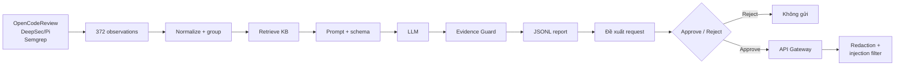

# Project Sentinel

Security Analysis Agent cho 100 test case đầu tiên của [OWASP BenchmarkJava](https://github.com/OWASP-Benchmark/BenchmarkJava). Scanner output được chuẩn hóa, nhóm theo test/CWE, viết report theo schema cố định, rồi mới đề xuất request. WebGoat không nằm trong dataset đang hoạt động.

[](https://sentinel-benchmarkjava.streamlit.app/)

Public UI đọc artifact đã commit. Không cần API key và không gọi API Gateway live.

## Review Week 5

Mentor mở [reports/week-5/README.md](reports/week-5/README.md) và đi đúng thứ tự: báo cáo → **Kiểm chứng an toàn** (Từ chối, rồi Duyệt và gửi) → `guardrails/`, test và `artifacts/week-5/`.

## Demo

Sidebar chia ba nhóm:

1. **PHÂN TÍCH** — Tổng quan, luồng hệ thống, lỗ hổng & bằng chứng, knowledge base, report của Agent. Mở thử `CWE-89` hoặc `CWE-327`.
2. **KIỂM CHỨNG** — **Kiểm chứng an toàn**: đề xuất request → **Từ chối** / **Duyệt và gửi** → phản hồi đã redact; prompt injection thì flag + quarantine.
3. **KẾT QUẢ** — số liệu vận hành, JSONL, kiểm định. Ma trận TP/TN/FP/FN trên UI đang lấy smoke/fake run Week 3, chưa phải evaluation set 5–10 case.

**Bắt đầu bản trình diễn** trên sidebar dẫn lần lượt. Public mode không gọi OpenCode.

## Pipeline



Python đọc artifact, group, retrieve KB, gọi provider, validate và ghi file. LLM chỉ điền field trong schema. `observation_id`, CWE, location và tool do Python gắn từ dữ liệu gốc — model không được sinh lại.

Week 4 để lại API Gateway (service ngoài repo): mọi probe qua một điểm, chỉ endpoint trong allowlist. Week 5 gắn guardrail trên Agent — redaction ở prompt và log, prompt-injection filter, approval gate — không viết lại Gateway. Reject = không gửi. Ground truth và nhãn TP/TN/FP/FN không vào prompt.

## Số liệu

| Hạng mục | Kết quả |
| :--- | ---: |
| BenchmarkJava test cases | 100 |
| Scanner observations | 372 |
| Analysis groups | 99 |
| Knowledge documents | 12 |
| FakeProvider full run | 99/99 |
| Real smoke run (artifact Week 3) | 5/5 |
| Schema / Guard / evidence | 100% |
| Secret còn trong prompt / log (fixture Week 5) | 0 |
| Approve / Reject (artifact Week 5) | 1 / 1 |
| Automated tests | 54 passed |

Observations: 131 OpenCodeReview, 152 DeepSec/Pi, 89 Semgrep `p/security-audit`. Nguồn: [baseline.json](artifacts/week-3/baseline.json), [agent-metrics.json](artifacts/week-3/evaluation/agent-metrics.json), [artifacts/week-5/](artifacts/week-5/). Fake 99/99 kiểm tra pipeline offline. Real 5/5 là smoke test LLM, không phải độ chính xác trên 99 groups.

Mỗi report giữ observation IDs, prompt hash, provider, model và run ID. Evidence Guard reject schema sai, field ngoài contract và citation không tồn tại. Run có manifest và SHA-256. System Prompt: [docs/prompts/week3-security-analysis-agent.md](docs/prompts/week3-security-analysis-agent.md).

## Chạy local

Python 3.11+ và [uv](https://docs.astral.sh/uv/):

```powershell
git submodule update --init --recursive
uv sync
uv run python -m sentinel_benchmark.indexer
uv run pytest -q
uv run streamlit run app/streamlit_app.py
```

Chỉ xem artifact: không cần model. Gọi LLM: copy `.env.example` → `.env`, điền `OPENCODE_API_KEY` và `CUSTOM_SCAN_MODEL`, đặt `SENTINEL_UI_READONLY=0`. CLI vẫn dùng `--provider nine_router`; `from_env()` đọc OpenCode.

```powershell
uv run python scripts/analyze.py baseline
uv run python scripts/analyze.py run --provider fake --limit 99 --tag ci-full
uv run python scripts/analyze.py preflight --provider nine_router
uv run python scripts/analyze.py run --provider nine_router --limit 5 --tag real-smoke
uv run python scripts/analyze.py evaluate --fake-tag ci-full --real-tag real-smoke
```

## Tiến độ

| Tuần | Sản phẩm |
| :--- | :--- |
| Week 1 | Scanner outputs, predictions, metrics, Semgrep SARIF |
| Week 2 | Observation schema, SQLite FTS5, knowledge base 12 tài liệu |
| Week 3 | Security Analysis Agent, Evidence Guard, JSONL, smoke evaluation |
| Week 4 | API Gateway (repo riêng): allowlist |
| Week 5 | Redaction, prompt-injection filter, approval gate — [review guide](reports/week-5/README.md) |

Báo cáo trong [`reports/`](reports/). Artifact trong [`artifacts/`](artifacts/).

## Tài liệu

- [Security Analysis Workspace](docs/security-analysis-workspace.md)
- [Phương pháp chọn 100 cases](docs/methodology/benchmark-sampling.md)
- [Cấu trúc repository](docs/repository-layout.md)
- [Deployment](docs/deployment.md)
- [Báo cáo Week 3](reports/week-3/2026-08-07_NguyenNhuYenPhuong_Week3.md)

## An toàn

BenchmarkJava chứa mã dễ bị khai thác theo thiết kế. Không deploy ứng dụng đó ra Internet. Streamlit chỉ hiển thị findings, metrics và report artifacts.
