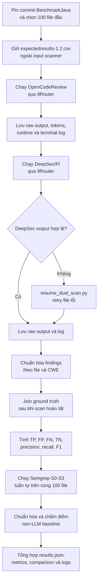

# BÁO CÁO KẾT QUẢ BENCHMARK THỬ NGHIỆM SAST (WEEK 1)

**Người thực hiện:** Nguyễn Như Yến Phương  
**Ngày báo cáo:** 29/07/2026  
**Dự án:** SAST Benchmark - Đánh giá công cụ kiểm thử an ninh mã nguồn dựa trên LLM  

---

### 1. Mục tiêu và Phạm vi Thực hiện

Trong tuần vừa rồi, em đã chạy bổ sung thử nghiệm trên repo có Ground Truth của OWASP (OWASP BenchmarkJava v1.2) và thiết lập môi trường để tiến hành quét so sánh thử nghiệm (comparative benchmark) giữa 2 công cụ SAST dựa trên LLM:
- **Phạm vi quét:** 100 file mã nguồn Java đầu tiên (`BenchmarkTest00001.java` đến `BenchmarkTest00100.java`).
- **Phân bố Ground Truth:** 75 file chứa lỗ hổng thực sự (Positive) và 25 file không chứa lỗ hổng (Negative).
- **Hệ thống thử nghiệm chính (Candidate):** Vercel DeepSec với Pi backend, sử dụng model qua 9Router.
- **Công cụ đối chiếu LLM (LLM Comparator):** Alibaba OpenCodeReview, sử dụng cùng model qua 9Router.
- **Cơ chế đánh giá:** Khởi chạy hai scanner qua Docker container, thu thập kết quả và đối chiếu trực tiếp với file `expectedresults-1.2.csv` của OWASP dựa trên mã CWE. Không sử dụng LLM để chấm điểm (chống bias), ground truth chỉ được join sau khi kết thúc quá trình quét (chống rò rỉ đáp án vào prompt).

#### Phân biệt scanner và harness

- **Candidate cần đánh giá:** Vercel DeepSec chạy qua Pi backend.
- **LLM comparator:** Alibaba OpenCodeReview. Công cụ này cung cấp một mốc đối chiếu LLM trên cùng model và cùng tập dữ liệu.
- **Non-LLM baseline:** Semgrep S0 với ruleset `p/java`.
- **Harness điều phối:** `sast-benchmark/harness/dual_scan.py`. File này không tự phát hiện lỗ hổng và không phải baseline; nó chỉ khóa manifest 100 file, gọi hai scanner độc lập, chuẩn hóa kết quả, rồi tính TP/FP/FN/TN.
- **Runner/adaptor DeepSec:** `harness/deepsec_benchmark.py`; `resume_dual_scan.py` chỉ dùng để retry/recovery khi một file lỗi.
- Hai scanner chạy độc lập và tuần tự trên cùng input. Kết quả không được truyền từ scanner này sang scanner kia.

Do đó, phép so sánh chính là **DeepSec/Pi với OpenCodeReview**; Semgrep S0 đóng vai trò baseline không dùng LLM. `dual_scan.py` chỉ là lớp chạy và chấm điểm chung, không phải scanner hoặc baseline.

---

### 2. Mô tả Mô hình và Vai trò của 9Router

Cả hai scanner đều được cấu hình để gửi yêu cầu phân tích qua **9Router** (đặt tại `http://127.0.0.1:20128/v1`), sử dụng chung model **`gc/gemini-2.5-flash`**.

**Vai trò của 9Router trong hệ thống:**
- **Thống nhất chuẩn API:** Cung cấp endpoint tương thích chuẩn OpenAI API cho cả 2 scanner chạy trong môi trường Docker cô lập.
- **Quản lý Gateway & Token:** Tự động điều phối kết nối, quản lý API key, xử lý retry khi gặp rate-limit hoặc ngắt kết nối mạng mà không cần lưu trữ cứng API key trong container hay chỉnh sửa source code của scanner.
- **Đảm bảo tính công bằng:** Đảm bảo cả hai công cụ đều truy cập cùng một hạ tầng LLM với tham số cấu hình tương đương.

---

### 3. Kết quả So sánh & Phân tích Metrics

Quá trình quét 100 file đã hoàn thành với độ bao phủ **100/100 files** cho cả 2 scanner (DeepSec gặp lỗi định dạng JSON tại `BenchmarkTest00043.java` đã được tự động retry và khôi phục thành công bằng script `resume_dual_scan.py`).

#### Bảng tổng hợp kết quả (Comparative Metrics)

| Chỉ số đánh giá | Alibaba OpenCodeReview (LLM Comparator) | Vercel DeepSec / Pi (Candidate) | Ghi chú so sánh |
| :--- | :---: | :---: | :--- |
| **Số file quét (Coverage)** | 100 / 100 | 100 / 100 | Cả hai đạt 100% |
| **Tổng số phát hiện (Findings)** | 131 | 152 | DeepSec báo nhiều lỗi hơn |
| **Input Tokens** | 1,153,796 | 777,529 | OpenCodeReview gửi nhiều ngữ cảnh hơn |
| **Output Tokens** | 63,087 | 223,313 | DeepSec sinh phản hồi dài hơn |
| **Tổng Tokens** | **1,216,883** | **1,000,842** | OpenCodeReview tốn hơn **21.6%** token |
| **Thời gian quét (Runtime)** | **2,408.00 s** (~40m 08s) | **1,909.34 s** (~31m 49s) | OpenCodeReview chậm hơn **26.1%** |
| **True Positives (TP)** | **60** | **64** | DeepSec phát hiện thêm 4 lỗ hổng |
| **False Positives (FP)** | **6** | **10** | OpenCodeReview ít báo động giả hơn |
| **False Negatives (FN)** | **15** | **11** | DeepSec ít bỏ sót hơn |
| **True Negatives (TN)** | **19** | **15** | OpenCodeReview nhận biết file sạch tốt hơn |
| **Precision** | **90.91%** | **86.49%** | OpenCodeReview cao hơn **+4.42%** |
| **Recall** | **80.00%** | **85.33%** | DeepSec cao hơn **+5.33%** |
| **F1-Score** | **85.11%** | **85.91%** | Tương đương nhau (~85.5%) |
| **False Positive Rate (FPR)** | **24.00%** | **40.00%** | OpenCodeReview giảm **16.00%** FP |

#### Nhận xét chi tiết:
1. **Độ chính xác (Precision & FP):** OpenCodeReview thể hiện ưu thế rõ rệt ở chỉ số Precision (90.91%) và tỷ lệ báo động giả thấp hơn (FPR 24% so với 40% của DeepSec). Điều này giúp giảm nhiễu cho nhà phát triển khi kiểm thử mã nguồn.
2. **Độ bao phủ lỗ hổng (Recall):** DeepSec có Recall nhỉnh hơn (85.33% vs 80.00%) nhờ khả năng phát hiện tốt ở các nhóm lỗi mã hóa (CWE-327) và cấu hình Cookie (CWE-614).
3. **Chi phí tài nguyên:** OpenCodeReview dùng nhiều Input Token hơn do đưa thêm thông tin ngữ cảnh/rules, trong khi DeepSec sinh ra Output Token gấp 3.5 lần do viết giải thích chi tiết từng cảnh báo.

---

### 4. Baseline và A/B testing đã thực hiện

**DeepSec/Pi candidate (D0):** Cấu hình hiện tại dùng thinking level `medium`,
batch size `1` và tối đa `80` agent turns. Đây là run DeepSec/Pi được dùng
trong bảng so sánh chính. D0 không phải là một A/B test; nó là cấu hình tham
chiếu của candidate.

**Semgrep configuration study:** Semgrep 1.172.0 được chạy trực tiếp trên
cùng 100 file Java, không dùng 9Router và không có token LLM. Ground truth
được đọc từ `expectedresults-1.2.csv` sau khi scanner kết thúc.

| Biến thể | Ruleset | Findings | TP | FP | FN | TN | Precision | Recall | F1 | Thời gian |
| :--- | :--- | ---: | ---: | ---: | ---: | ---: | ---: | ---: | ---: | ---: |
| S0 | `p/java` | 75 | 43 | 4 | 32 | 21 | 91.49% | 57.33% | 70.49% | 17.04 s |
| S1 | `p/security-audit` | 89 | 57 | 4 | 18 | 21 | 93.44% | 76.00% | 83.82% | 18.01 s |
| S2 | `p/java` + `p/security-audit` | 89 | 57 | 4 | 18 | 21 | 93.44% | 76.00% | 83.82% | 17.93 s |
| S3 | `p/java`, chỉ `ERROR` | 23 | 15 | 4 | 60 | 21 | 78.95% | 20.00% | 31.91% | 12.13 s |

Semgrep S0 là baseline non-LLM chính. S1–S3 là các A/B test về cấu hình Semgrep, không phải ablation của DeepSec. S1/S2 cho thấy ruleset `security-audit` bắt được nhiều CWE hơn mà không tăng FP trên tập 100 file. S3 giảm thời gian và số finding nhưng bỏ sót nhiều lỗi; đây là trade-off của ngưỡng severity, không phải thay đổi thuật toán phân tích.

Kết quả được lưu tại:
`sast-benchmark/runs/20260729T040126Z-semgrep-first100/`.

Mỗi biến thể có `raw.json`, `terminal.log`, `findings.jsonl`, `predictions.jsonl` và `metrics.json`. Bảng tổng hợp nằm trong `results.json` và `comparison.md`.

Bảng đối chiếu chung giữa OpenCodeReview, DeepSec/Pi và các biến thể Semgrep nằm trong `sast-benchmark/runs/20260729T040126Z-semgrep-first100/comparison-all-scanners.md`.

---

### 5. Workflow chạy scan



Hai scanner LLM chạy độc lập và tuần tự, không truyền findings cho nhau.
Semgrep được chạy sau đó như baseline non-LLM và configuration study.

Lệnh chạy chính:

```powershell
cd ..\sentinel-week1\sast-benchmark
rtk python -u -B .\harness\dual_scan.py --count 100
rtk python -u -B .\harness\semgrep_baseline.py --count 100
```

Output được in trực tiếp trên terminal. Log LLM được lưu trong
`runs/<run-id>/logs/`; log Semgrep được lưu trong
`runs/<run-id>/variants/<variant>/terminal.log`.

Report giữ các lệnh tối thiểu để tái lập run; hướng dẫn đầy đủ về cấu trúc
repo, biến thể, recovery và đóng gói artifact nằm trong
`sast-benchmark/README.md`.

---

### 6. Việc chưa làm

- Chưa chạy D1–D3 trên DeepSec/Pi (thinking level, context/batch grouping và agent-turn budget). Vì vậy chưa có kết luận ablation cho DeepSec.
- Chưa quét toàn bộ 2.740 test case của BenchmarkJava; kết quả hiện tại chỉ đại diện cho 100 file đầu.
- Chưa lặp lại mỗi cấu hình nhiều lần, nên chưa có độ lệch chuẩn hoặc khoảng tin cậy cho các metrics.
- Chưa thực hiện kiểm định ý nghĩa thống kê giữa các scanner.
