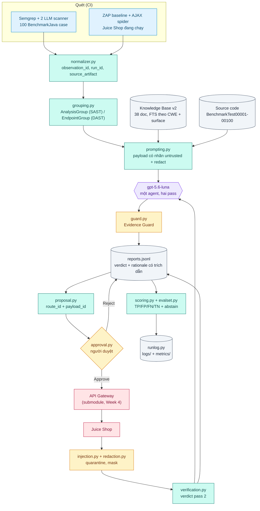

# Kiến trúc Project Sentinel

## 1. Một câu về hệ thống

Sentinel biến **quan sát của scanner** thành **kết luận có thể kiểm chứng**: nó
gom cảnh báo từ SAST và DAST, để một LLM ra verdict kèm trích dẫn, rồi - khi cần
bằng chứng sống - xin người duyệt một request đọc-thuần, gửi qua API Gateway, và
dùng response thật để xác nhận hoặc bác bỏ verdict đó.

Nguyên tắc xuyên suốt: **Python sở hữu mọi thứ đo được, LLM chỉ diễn giải.**
Grouping, retrieval, lắp prompt, allowlist, approval gate, redaction, validation
đều là code. Model điền một hợp đồng JSON cố định và không làm gì khác. Guard là
Python nên nó không hỏi lại model để tự phê duyệt chính mình.

## 2. Luồng end-to-end

Mỗi mắt chạy độc lập được (`scripts/analyze.py`, `scripts/probe.py`,
`scripts/security/zap_dast.py`); `scripts/flow.py` chạy cả chuỗi trong một
process và ghi một log + một metrics file, vì *"từng bước chạy được"* và
*"cả luồng chạy được"* là hai khẳng định khác nhau.

## 3. Bốn ranh giới tin cậy

| Ranh giới | Ai canh | Điều gì không được đi qua |
| :--- | :--- | :--- |
| Scanner output / source / HTTP response → prompt | `prompting.py` + `injection.py` | Nội dung untrusted không bao giờ nằm ở chỗ dành cho chỉ thị; nó được gắn nhãn DATA và quarantine nếu khớp pattern injection |
| Bất cứ gì → LLM hoặc log | `redaction.py` tại sink | Email, phone, token, API key, password, PII dạng chuỗi |
| Model output → report | `guard.py` | Field ngoài hợp đồng, verdict không trích dẫn `observation_id`, `confirmed_vulnerable` không có excerpt, pass 2 khẳng định một phép đo |
| Agent → mạng | `approval.py` + gateway allowlist | Endpoint ngoài allowlist, payload ngoài catalog, mọi POST/payload đặc biệt chưa được người duyệt |

Ranh giới thứ tư là ranh giới cứng nhất: request tool **chỉ nhận `route_id` và
`payload_id`**, không nhận URL. Không có URL trong tay agent thì không có cách
nào để một câu chữ trong response điều nó tới đích khác.

## 4. Hai pass, một model

`gpt-5.6-luna` đảm nhiệm cả hai vai, phân biệt bằng system prompt
(`docs/prompts/week6-security-analysis-agent.md`, `week6-agent-v4`):

- **Pass 1 - phân tích.** Vào: evidence của scanner + source code (SAST) + doc
  KB. Ra: verdict 5 mức + rationale có trích dẫn + `false_positive_indicators`.
- **Pass 2 - xác minh.** Vào: verdict cũ + những gì Python **đo được** từ
  response. Ra: chỉ `verdict`, `verdict_rationale`, `observed[]`. Verdict cũ
  không bị xoá, nó nằm trong `verification.verdict_before`.

Dùng một model chứ không phải hai vì thứ thay đổi giữa hai pass là **bằng
chứng**, không phải năng lực. Nếu đổi model, không còn phân biệt được "probe làm
đổi kết luận" với "model khác nghĩ khác".

## 5. Cấu trúc mã

| Vị trí | Vai trò |
| :--- | :--- |
| `src/sentinel_benchmark/analysis/` | grouping, prompting, providers, guard, runner, verification, scoring, evalset, source_context |
| `src/sentinel_benchmark/guardrails/` | injection, redaction, approval |
| `src/sentinel_benchmark/probe/` | payloads (catalog), client (gateway), proposal (route binding), runner (gửi có kiểm soát) |
| `src/sentinel_benchmark/runlog.py` | log + metrics một chỗ, redact tại sink |
| `app/web/` | FastAPI + JS dashboard đọc artifact đã commit |
| `vendor/api-gateway/` | submodule Week 4, ghim commit |
| `vendor/BenchmarkJava/` | submodule corpus, ghim commit |

Không fork mã theo tuần: cùng một `analysis/` phục vụ Week 3 đến Week 6.

## 6. Những quyết định đáng giải thích

**Gateway là service ngoài, không vendor vào code.** Request tool chỉ biết địa
chỉ gateway. Đổi allowlist là đổi `configs/gateway-policy.yml` rồi restart
gateway, không phải sửa code agent.

**Allowlist hẹp hơn bề mặt quét, và hẹp có lý do.** 16/18 finding DAST có route;
2 cái còn lại là đường dẫn AJAX spider bóc từ stack trace bị lộ
(`/juice-shop/node_modules/express/lib/router/index.js:365:14`) - không phải
endpoint của ứng dụng, và probe một trang 404 thì không chứng minh được gì.

**Route có tham số được bind từ URL thật.** Scanner báo `/ftp/eastere.gg`, policy
công bố `/ftp/{file}`; `proposal.bind` khớp hai thứ đó và chỉ nhận một segment an
toàn, nên không thể nới thành traversal.

**Một response phục vụ nhiều finding.** 3 alert trên `/` được trả lời bởi một
GET: người duyệt bị hỏi một lần, không phải ba.

**Abstention đếm riêng.** Gộp `insufficient_evidence` vào FP/FN thì agent chỉ cần
từ chối trả lời là precision đẹp lên. Đúng cái động cơ ngược cần tránh.

## 7. Giới hạn đã biết

- **DAST là passive.** ZAP baseline spider và đọc traffic, không tấn công. Nó
  không tìm được SQLi/XSS thực thi được; những gì nó báo phần lớn là thiếu
  header và lộ thông tin.
- **Verdict DAST không có corpus ground truth.** Không có corpus nào nói đúng/sai
  cho một endpoint Juice Shop. Precision/Recall của nhánh này là LLM-as-judge
  (Grok 4.5, `analysis/judge.py`), join sau khi report nằm đĩa. Coverage
  (response thật / verdict đổi) và eval set tự viết (`datasets/evaluation/`)
  vẫn là các thước độc lập.
- **Source code chỉ có cho corpus.** Endpoint sống không có file nào để đọc, nên
  pass 1 của DAST luôn nghèo bằng chứng hơn SAST - đó là lý do abstain cao và là
  lý do probe tồn tại.
- **Không có state.** Mỗi request là độc lập; không login, không session, nên
  những lỗ hổng chỉ xuất hiện sau khi xác thực nằm ngoài tầm.
- **LLM còn sai.** Xem `artifacts/week-6/evaluation/eval-cases-failures.jsonl`
  và [../methodology/verdict-and-scoring.md](../methodology/verdict-and-scoring.md) cho các case cụ thể và cách sửa.
- **Rủi ro còn lại:** BenchmarkJava và Juice Shop đều cố tình có lỗ hổng và
  **không được** deploy ra môi trường công khai; `docker-compose.yml` không mở
  port cho hai app đó, mọi đường vào đi qua gateway.
