# BÁO CÁO XÂY DỰNG SECURITY ANALYSIS AGENT (WEEK 3)

**Người thực hiện:** Nguyễn Như Yến Phương  
**Ngày báo cáo:** 07/08/2026  
**Dự án:** Project Sentinel - Phân tích kết quả quét và sinh báo cáo bảo mật  
**Phạm vi:** 100 test case đầu tiên của OWASP BenchmarkJava

---

### 1. Mục tiêu và kết quả cần đạt

Trong Week 3, em xây dựng một Security Analysis Agent có thể đọc kết quả scan của Week 1, tra cứu kho tri thức Week 2 và tạo báo cáo dễ đọc cho từng nhóm lỗ hổng. Báo cáo giữ lại vị trí, bằng chứng và công cụ phát hiện; đồng thời bổ sung mức nghiêm trọng, giải thích đơn giản, cách xác minh, hướng khắc phục và độ tin cậy. Kết quả được lưu dưới dạng JSONL để có thể kiểm tra lại hoặc tải từ giao diện.

---

### 2. Kiến trúc và luồng xử lý

```mermaid
flowchart LR
    A[3 scanner outputs<br/>372 observations] --> B[Normalize và group<br/>99 analysis groups]
    B --> C[Retrieve hướng dẫn<br/>từ 12 tài liệu KB]
    C --> D[Ghép evidence + KB<br/>vào prompt có schema]
    D --> E[9Router LLM<br/>phân tích lỗ hổng]
    E --> F[Pydantic + Evidence Guard<br/>kiểm tra JSON và nguồn]
    F --> G[JSONL report<br/>UI, review và export]

    classDef input fill:#E0F2FE,stroke:#0284C7,color:#0C4A6E;
    classDef process fill:#CCFBF1,stroke:#0F766E,color:#134E4A;
    classDef ai fill:#EDE9FE,stroke:#7C3AED,color:#4C1D95;
    classDef guard fill:#FEF3C7,stroke:#D97706,color:#78350F;
    classDef output fill:#DCFCE7,stroke:#16A34A,color:#14532D;
    class A input;
    class B,C,D process;
    class E ai;
    class F guard;
    class G output;
```

Python thực hiện phần có thể kiểm chứng: đọc artifact, nhóm cảnh báo, tìm tài liệu KB, gọi model, kiểm tra kết quả và ghi JSONL. LLM chỉ viết phần phân tích; model không được tự tạo hoặc thay đổi test ID, CWE, scanner, vị trí hay observation ID. Cách tách này giúp báo cáo không xuất hiện endpoint hoặc bằng chứng không có trong dữ liệu gốc.

### 3. LLM, System Prompt và tool call

Agent gọi 9Router bằng model ID `ag/gemini-3-flash-agent`; metadata của response ghi model `gemini-default`. System Prompt được lưu tại `docs/prompts/week3-security-analysis-agent.md`, với hai yêu cầu chính: mọi nhận định phải dựa trên scanner evidence/KB đã cung cấp và không được bịa identifier, location, tool, CWE hoặc verdict.

Model **không tự gọi tool**. Thay vào đó, Python chủ động gọi các thành phần cần thiết theo flow cố định: grouping, keyword retrieval, provider và Evidence Guard. Nếu JSON sai schema, hệ thống phản hồi lỗi cho model và retry một lần; nếu vẫn sai, group đó được ghi vào error artifact thay vì làm dừng cả batch.

---

### 4. Kết quả và kiểm thử

| Hạng mục | Kết quả |
| :--- | ---: |
| Observations được đưa vào grouping | 372/372 |
| Duplicate assignment | 0 |
| FakeProvider - kiểm thử toàn bộ pipeline | 99/99 groups |
| 9Router - real smoke test | 5/5 groups |
| Schema / Guard / evidence preservation | 100% / 100% / 100% |

Các test bao phủ input rỗng, JSON không hợp lệ và retry, lỗi một group không làm dừng batch, citation/field bịa bị chặn, SSE response của 9Router và checksum artifact. UI cho phép chọn lỗ hổng theo tên CWE, xem evidence/KB, tạo report, hỏi đáp và tải JSONL.

---

### 5. Deliverables và giới hạn

- `src/sentinel_benchmark/analysis/` - grouping, prompt, provider, Guard, runner và evaluation.
- `docs/prompts/week3-security-analysis-agent.md` - System Prompt và output contract.
- `artifacts/week-3/runs/` - FakeProvider full run và 9Router real run có checksum.
- `reports/week-3/week-3.md` - báo cáo tuần được sinh từ metrics thật.
- `app/streamlit_app.py` - giao diện xem evidence, Agent report và Ask Sentinel.

Real LLM hiện mới được smoke test trên 5 groups; nội dung giải thích và khắc phục vẫn cần human review trước khi sử dụng trong môi trường thực tế.
