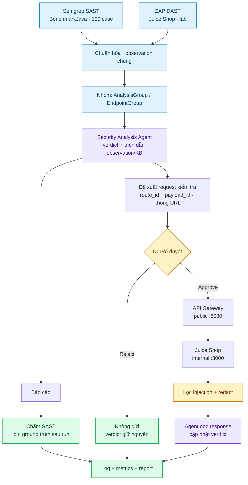

# BÁO CÁO TÍCH HỢP END-TO-END VÀ ĐÁNH GIÁ (WEEK 6)

**Người thực hiện:** Nguyễn Như Yến Phương  
**Ngày báo cáo:** 22/08/2026    
**Dự án:** Project Sentinel - phân tích kết quả quét và kiểm chứng bằng request thật    
**Phạm vi:** 100 test case đầu của OWASP BenchmarkJava (SAST) + OWASP Juice Shop (DAST) 

## Mục lục

1. [Mục tiêu](#1-mục-tiêu)
2. [Quá trình](#2-quá-trình)
3. [Luồng end-to-end](#3-luồng-end-to-end)
4. [Kết quả](#4-kết-quả)
5. [Agent sai ở đâu và vì sao](#5-agent-sai-ở-đâu-và-vì-sao)
6. [Giới hạn và bước tiếp](#6-giới-hạn-và-bước-tiếp)

---

## 1. Mục tiêu

Week 5 đã có guardrail nhưng chưa có "thật": không có ứng dụng nào đang chạy để
gửi request, nên approval gate chỉ được thử trên dữ liệu mẫu. Week 6 em nối cả
chuỗi lại: một lần quét thật → agent ra kết luận → đề xuất request → người duyệt →
đi qua API Gateway → response thật cập nhật kết luận → ghi log và số đo. Mục tiêu
cuối là mỗi con số trong báo cáo truy được về một file bằng chứng đã commit.

## 2. Quá trình

**Nhánh DAST.** Em thêm OWASP Juice Shop và ZAP baseline vào Docker Compose. ZAP
nằm trên mạng nội bộ và quét trực tiếp Juice Shop (nó là scanner, giống Semgrep
đọc codebase); agent thì không có đường đó. Ban đầu scan chỉ ra 4 alert trên asset
tĩnh - thiếu AJAX spider, mà Juice Shop là SPA Angular. Bật cờ `-j`: 9 loại alert
trên 18 URL, chuẩn hóa thành 33 observation. Provenance (version, image digest,
command, sha256 output) được sinh **từ chính artifact**, nên manifest không lệch
khỏi bằng chứng nó mô tả.

**Verdict.** Đến Week 5, agent viết giải thích cho mọi alert và **chưa bao giờ**
nói "cái này scanner báo nhầm" - nó chưa làm việc chính của người phân tích là
sàng lọc. Em thay bằng một verdict 5 giá trị, kèm hai luật Guard (Python, không
hỏi lại model): rationale **buộc phải** trích dẫn `observation_id` và document KB;
`confirmed_vulnerable` buộc phải có excerpt thật. `insufficient_evidence` được đếm
riêng thành *abstain*, không nhét vào FP/FN - nếu gộp thì agent chỉ cần từ chối
trả lời là precision đẹp lên.

**Request tool.** Tool chỉ nhận `route_id` và `payload_id` từ allowlist mà gateway
công bố, **không nhận URL**. Đó là ràng buộc quan trọng nhất: không có URL trong
tay thì không câu chữ nào trong response điều được nó tới đích khác. Mỗi request
phải qua approval gate; response chạy qua scan injection + redact trước khi tới
report. Em cũng phát hiện gateway đang cắt gần hết response header nên không thể
xác minh các finding kiểu "thiếu CSP" - đã sửa ở repo gateway và ghim lại
submodule.

**Source code vào payload.** Đây là thay đổi có tác dụng lớn nhất, và lý do do
chính agent nói ra trong rationale: *"the supplied excerpt is descriptive rather
than source code"*. Nó chỉ có mô tả của scanner - vốn đã khẳng định sẵn là có lỗi
- nên không có gì để phản biện. Em đưa source thật của test case vào payload
(line-numbered, coi như untrusted data, redact ở sink, chỉ resolve theo test id
nên không thể bị path traversal).

**Đóng vòng đo.** Em thêm `scripts/flow.py` chạy cả chuỗi trong một process và ghi
một log + một metrics file; `scoring.py` chấm theo ground truth (join **sau khi**
report đã ghi ra đĩa); và 10 case eval với expected answer em tự viết bằng cách
đọc source hoặc response, mỗi case kèm lập luận để tự bảo vệ khi agent phản đối.

## 3. Luồng end-to-end

Repo chạy đúng chín bước mentor yêu cầu, trên **một agent / một hợp đồng JSON**,
nhưng **hai nguồn bằng chứng** không đi hết cùng một đường. Semgrep đọc 100 case
BenchmarkJava (có ground truth, không deploy). ZAP đọc Juice Shop đang chạy
(không có ground truth, nhưng có endpoint sống). Cả hai được chuẩn hóa cùng
schema rồi vào cùng Security Analysis Agent. Bước đề xuất request → duyệt →
Gateway → lọc response → cập nhật report **chỉ có ở nhánh DAST**, vì SAST không
có URL để gửi. SAST sau khi có report thì join ground truth (sau khi ghi đĩa) để
ra TP/FP/FN/TN.



Cổng: chỉ gateway publish ra máy (`localhost:8080`). Juice Shop lắng nghe
`:3000` trong mạng compose, **không** map port ra host - agent chỉ gọi
`http://juice-shop:3000` gián tiếp qua gateway.

Ánh xạ sang chín bước: (1) CI Semgrep **hoặc** ZAP → (2) normalize → (3) Agent
pass 1 → (4) report + đề xuất probe (DAST) → (5) Approve/Reject → (6) Gateway →
(7) injection-scan + redact → (8) Agent pass 2 ghi `verification.verdict_before`
/ `verdict_after` → (9) `scripts/flow.py` ghi log và `artifacts/week-6/metrics/`.

Một lần DAST chạy thật, 173 giây: 10 request đề xuất phủ 16 finding, **8 duyệt /
2 từ chối**, 12 verdict được response thật trả lời, **6 verdict đổi** so với
trước probe. Counter `probes.rejected_but_sent = 0` được đếm tách và có test,
vì đó là thất bại tệ nhất hệ thống này có thể mắc.

## 4. Kết quả

| SAST - 25 nhóm, `gpt-5.6-luna` | scanner-only, KB v1 | + source code, KB v2 |
| :--- | ---: | ---: |
| True positive | 20 | 21 |
| False positive | 4 | **2** |
| False negative | 0 | 0 |
| **True negative** | **0** | **2** |
| Precision / Recall / F1 | 0.833 / 1.0 / 0.909 | **0.913** / 1.0 / **0.955** |

`TN 0 → 2` là điểm chính: agent bắt đầu dám kết luận "không phải lỗ hổng".
`FN = 0` là điểm quan trọng về an toàn: không lỗ hổng thật nào bị bỏ qua - sai số
của agent nghiêng về cẩn thận quá mức, không nghiêng về bỏ sót.

**DAST.** 18 endpoint group: 5 `confirmed_vulnerable`, 3 `likely_vulnerable`,
5 `not_vulnerable`, 1 `likely_false_positive`, 4 `insufficient_evidence`. Lỗ hổng
được xác nhận: CWE-693 (thiếu security header) 5, CWE-497 (lộ thông tin) 2,
CWE-264 1. Đáng chú ý nhất là `/rest/admin/application-configuration` trả toàn bộ
configuration cho một GET không cần xác thực - xác nhận bằng response thật, không
phải bằng lời scanner.

Ví dụ probe đổi kết luận:

```
/ + CWE-693   insufficient_evidence  ->  confirmed_vulnerable
   observed: Content-Security-Policy is absent from the response headers.
```

Verdict cũ **không bị xoá**, nó nằm trong `verification.verdict_before`, nên
"probe làm đổi kết luận" là điều kiểm chứng được chứ không phải lời kể.

**Guardrail trên HTTP thật.** `probe.py injection-check` POST fixture crafted tới
`/echo`, nhận lại như một response untrusted: 5/5 PASS - tới đích, bị flag, đúng
pattern, response bị quarantine thành DATA, không secret nào sống sót. Text
injection được **giữ nguyên** trong delimiter chứ không bị làm sạch thầm, vì nó
còn là bằng chứng.

**Kiểm chứng:** 140/140 test pass. Không secret và không đường dẫn tuyệt đối trong
artifact sắp publish (`scripts/security/artifact_hygiene.py`, chạy cả trong CI).

## 5. Agent sai ở đâu và vì sao

Cả **3 false positive còn lại cùng một nguyên nhân**, và đó không phải lỗi thiếu
kiến thức:

| Case | CWE được báo | Agent **tự nói** | Verdict nó ra |
| :--- | :--- | :--- | :--- |
| `00009` | CWE-328 weak hash | *"SHA-384 is strong and not the issue"* | `confirmed_vulnerable` - vì `FileWriter` có thể cạn đĩa |
| `00016` | CWE-614 cookie thiếu Secure | *"Secure and HttpOnly mitigate the primary risks"* | `likely_vulnerable` - vì giá trị cookie từ input |
| `00022` | CWE-328 weak hash | *"SHA-2 is not a CWE-328 weak hash"* | `likely_vulnerable` - vì hash mật khẩu không salt |

Cả ba đều nêu **đúng** chi tiết quyết định rồi ra verdict ngược lại với chính nó:
nó trả lời "file này có vấn đề gì không" thay vì "lỗ hổng được báo có thật
không". Ba nhận định đó đều đúng về kỹ thuật, chỉ là chúng nói về weakness khác.

Em thử sửa bằng KB và bằng prompt, kết quả khác nhau rõ:

| Cách sửa | Kết quả |
| :--- | :--- |
| Thêm `KB-328-HASH` | **Có tác dụng** - agent giờ nói đúng về SHA-2/SHA-3, thấy rõ trong rationale |
| Thắt `KB-003` (path traversal) | **Sửa hẳn 1 FN**, có case đối chứng |
| Prompt v4: luật phạm vi cho pass 1 | **Không sửa được** - precision 0.913 → 0.875, lệch một case ở n=25 nên là nhiễu, không phải cải thiện |
| Prompt v4: cho pass 2 kết luận "không phải lỗ hổng" | **Sửa hẳn phía DAST** - abstain sau probe 12 → 4, `not_vulnerable` lần đầu xuất hiện |

Bài học: **ràng buộc nào Python kiểm được thì đừng thuyết phục bằng prompt**; thứ
gì là kiến thức thiếu thì sửa ở KB, đừng sửa ở prompt.

## 6. Giới hạn và bước tiếp

**Giới hạn.** DAST là passive nên không tìm được SQLi/XSS thực thi được. Không có
luồng xác thực, nên lớp lỗ hổng sau đăng nhập nằm ngoài tầm. DAST không có ground
truth, nên phần chất lượng dựa vào eval set tự viết. Mọi so sánh A/B ở trên lệch
nhau 1-3 case trên n=25 - đủ để chỉ ra nguyên nhân, không đủ để xếp hạng. 2/18
finding DAST không probe được vì chúng là đường dẫn AJAX spider bóc từ stack trace
bị lộ, không phải endpoint thật.

**Bước tiếp, theo thứ tự giá trị.** (1) Thêm field `verdict_cwe` vào hợp đồng và
để Guard chặn stance vulnerable nếu nó không nằm trong CWE được báo - cơ chế nhắm
đúng nguyên nhân đứng sau 3/3 FP còn lại. (2) Cho agent một chỗ đúng để ghi
weakness khác nó phát hiện, thay vì nhét vào verdict. (3) Chặn ở normalizer những
"endpoint" vốn là đường dẫn trong stack trace. (4) Mở rộng corpus để con số có ý
nghĩa thống kê.

**Bàn giao:** [docs/handover/](../../docs/handover/README.md) - kiến trúc, hướng
dẫn cài đặt, kịch bản demo, báo cáo kết quả chi tiết, giới hạn và rủi ro bảo mật
còn tồn tại, product brief.
